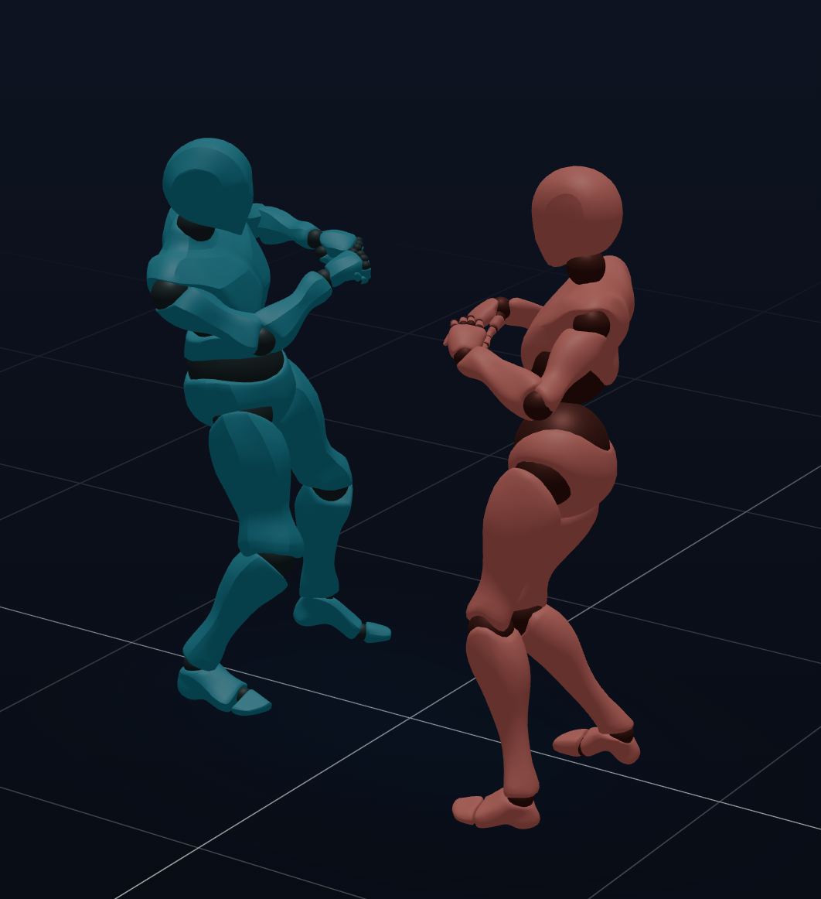

# Svelte Threlte WebComponent 3d view-port

```html
<script type="module" src="https://zavx0z.github.io/view-port-threlte/dist/view-port.js"></script>
<view-port cellColor="#ffffff" sectionColor="blue"></view-port>
```


